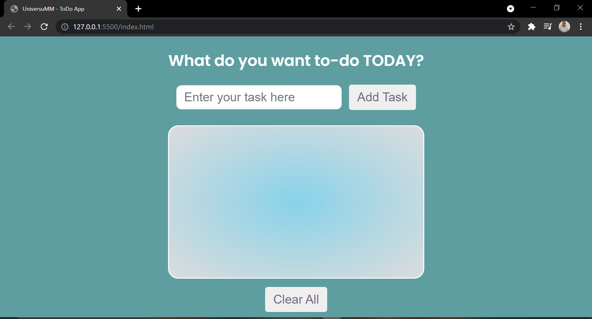
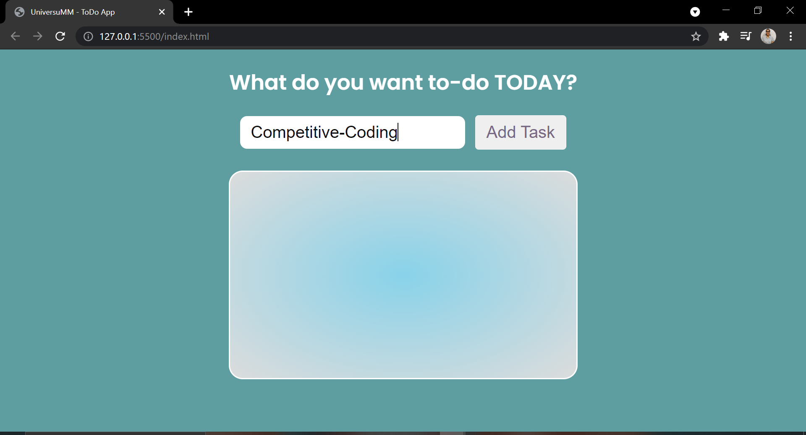
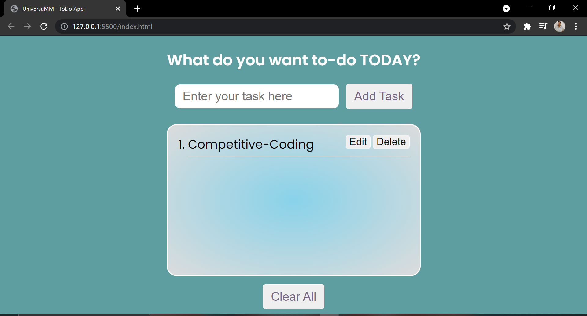
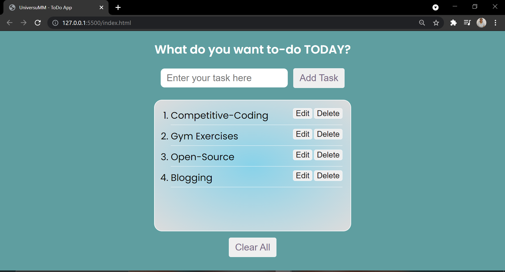
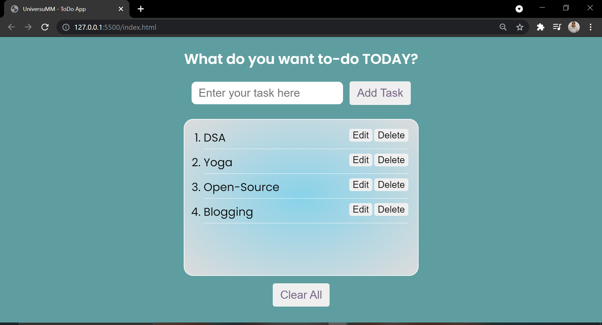
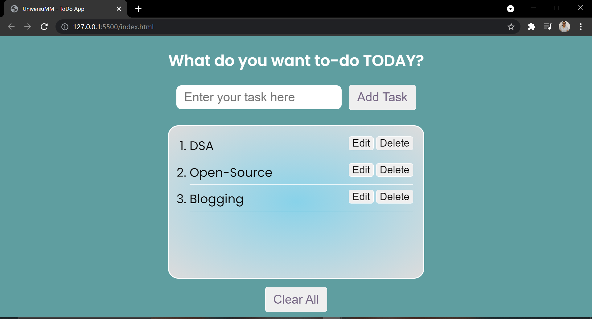

<h1>APP Screenshots</h1>

<h3>APP initially - Empty List (<b>NO TASKS added</b>)</h3>

<h3>Adding <b>Task-1</b></h3>

<h3>Added 1st Task in the List</h3>

<h3><i>Added More Tasks</i></h3>

<h3><i>Editing</i> Task-2 to Yoga</h3>

<h3><i>Edited</i> <b>Task-1</b> to <b>"DSA"</b></h3>

<h3><i>Deleted</i> <b>Task-2</b> "Yoga" from the List</h3>
